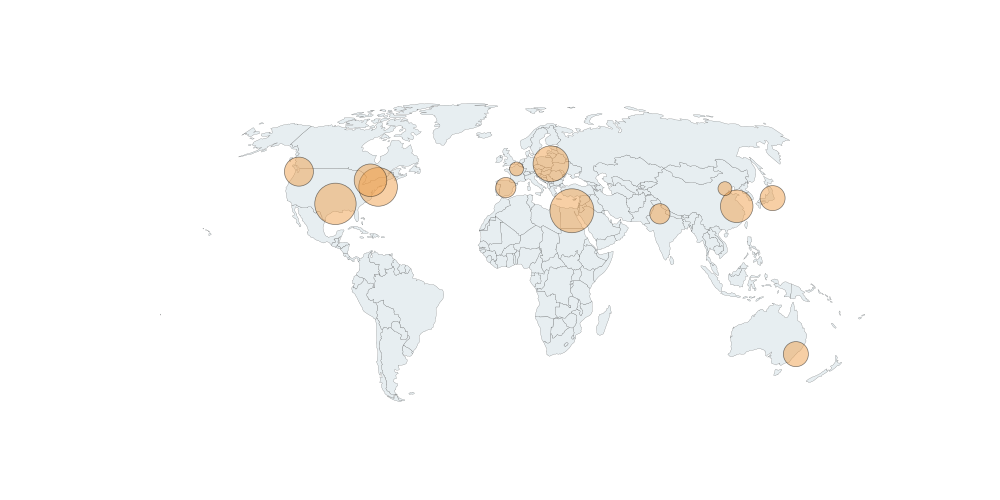

# Mapping Plots

## Functions
Mapping data on a map

## Dependencies
[pandas](https://pandas.pydata.org/)
[geopandas](http://geopandas.org/)
[matplotlib](https://matplotlib.org/)

## How to use
Input city names: `cities = ['new york', 'paris', 'sydney', 'beijing']` -> the city names are NOT case-sensitive.
Input city values: `values = [1,2,3,4]` -> the values will be auto-scaled.
Choose map projection: `projMethod = 'World Robinson'` 
Done!

