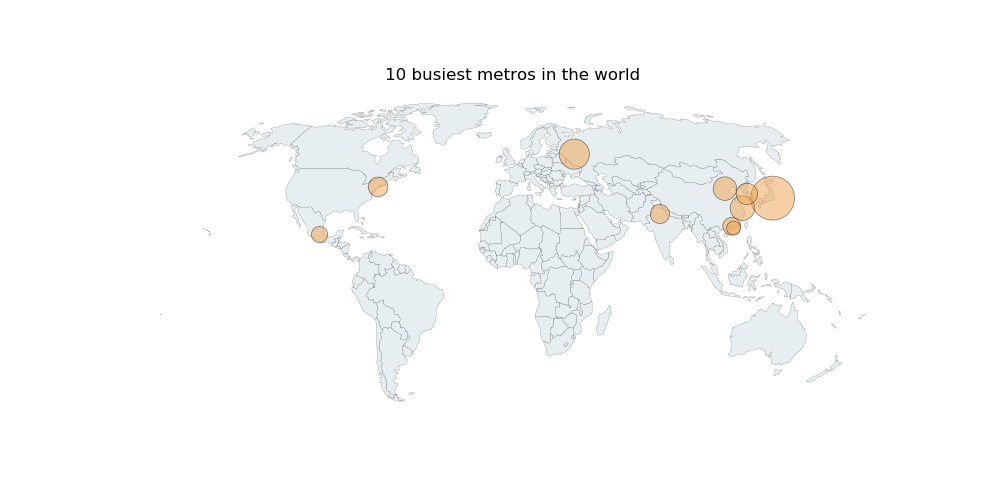

# Mapping Plots

## Functions
Mapping data on a map

## Dependencies
 - [pandas](https://pandas.pydata.org/)
 - [geopandas](http://geopandas.org/)
 - [matplotlib](https://matplotlib.org/)

## How to use
 - Input city names: `cities = ['tokyo','moscow','shanghai','beijing','seoul','new york','new delhi','guangzhou','mexico city','hong kong']` -> the city names are NOT case-sensitive.
 - Input city values: `values = [3463,2369,2044,1988,1885,1806,1789,1730,1678,1600]` -> the values will be auto-scaled.
 - Choose map projection: `projMethod = 'World Robinson'` 
 - Set map title: `mapTitle = '10 busiest metros in the world'`
 - Done!

